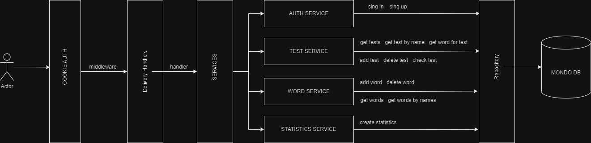

# marat-tatar.site

## Стек:
+ golang 1.20.2
+ Mongo DB
+ Docker

Постарался реализовать архитектуру с разделением слоев.

## Функционал:
+ Авторизация с JWT токеном через Cookie
+ Аутенфикация юзера и адмимна
+ Добавление, удаление слов
+ Добавление, удаление, генерация, проверка тестов
+ Сбор статистики по тестам в .xlsx файл

## Запуск
### Через докер
1. `docker pull giicoo/marat-site`
1. `docker pull mongo`
1. `docker run -p 27017:27017 --name mongodb -d --net=bridge  -v mongodbdata:/data/db mongo `
1. `docker run -it  -p 8080:8080  --name marat giicoo/marat-site`

### Без докера
1. `git clone https://github.com/giicoo/maratWebSite`
1. `go mod download`
1. Запустить mongo db 
1. В файле `/configs/config.json` поменять MONGO_DB на вашу ссылку для соединения
1. `make run`